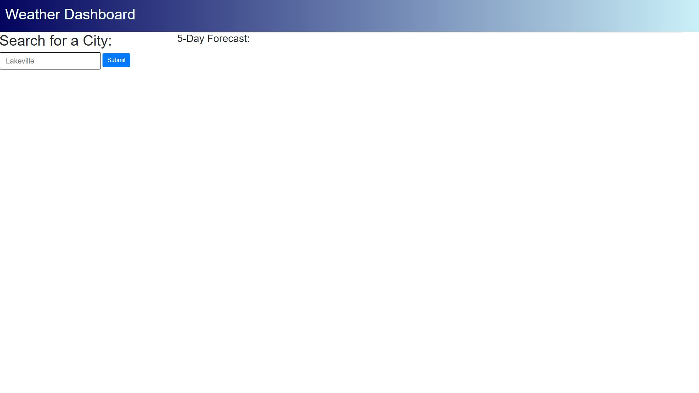
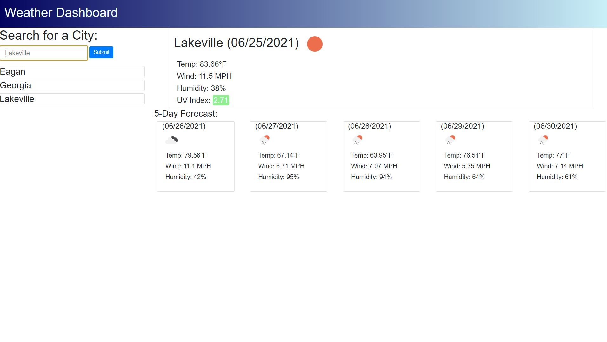
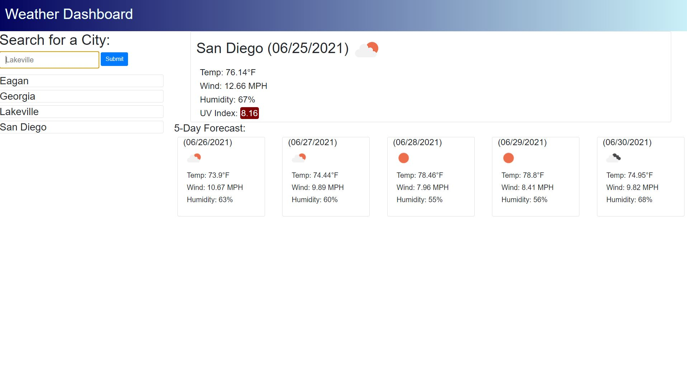

# Weather-Dashboard

This is a Weather Dashboard. The user may enter in a city within the United States and upon pressing submit the webpage will populate with cards that display the current weather data for the city as well as the next 5 day forecast. Once a city is searched, it will appear in a list beneath the search bar. If the card containing a previously searched city is clicked, the webpage will load the weather for the previously searched city.

**Above is an image that shows what the webpage looks like with no previous search results and upon first load.**

 

**Above is an image that shows what a populated weather report for the city of Lakeville would look like. As can be seen on the right hand side, Eagan and Georgia were two of the previous searches. If clicked, the webpage would repopulate with the weather data for the clicked city.**

 

**Above is an image that shows the dynamic UV Index reading. Depending on how high or low the UV Index is, the color of the box will change. As can be seen in the image above this one, the UVI is green. In the above image, it shows up as a maroon color showing that the UVI is higher in San Diego.**

 

Link to the deployed webpage: https://zacharyjg00.github.io/Weather-Dashboard/